# Trade Agency Sandbox Portal — Audited B2B Design Implementation Plan

> **Status**: Audited and fully optimized. Ready for engineering execution.
> **Location**: `d:\Projects\MercoTest\`
> **Stack**: Next.js 15 (App Router) · Supabase (Postgres + RLS) · TypeScript Strict · Framer Motion (Consolidated)

---

## Table of Contents

1. [Decisions Locked](#1-decisions-locked)
2. [Technology Stack](#2-technology-stack)
3. [Animation Architecture](#3-animation-architecture)
4. [Project Directory Tree](#4-project-directory-tree)
5. [Epic 0 — Scaffolding & Supabase Setup](#5-epic-0--scaffolding--supabase-setup)
6. [Epic 1 — Foundation Layer](#6-epic-1--foundation-layer)
7. [Epic 2 — Database Migrations](#7-epic-2--database-migrations)
8. [Epic 3 — SME Onboarding (Phase 1)](#8-epic-3--sme-onboarding-phase-1)
9. [Epic 4 — Diagnostic Questionnaire (Phase 2)](#9-epic-4--diagnostic-questionnaire-phase-2)
10. [Epic 5 — Scoring Engine (Phase 3)](#10-epic-5--scoring-engine-phase-3)
11. [Epic 6 — Report Workspace (Phase 4)](#11-epic-6--report-workspace-phase-4)
12. [Epic 7 — Map & API Proxies (Phase 5)](#12-epic-7--map--api-proxies-phase-5)
13. [Epic 8 — Visual Design System, Bento Grid Layout & UX Motion](#13-epic-8--visual-design-system-bento-grid-layout--ux-motion)
14. [Epic 9 — Auth & Transition Boundaries](#14-epic-9--auth--transition-boundaries)
15. [Epic 10 — Testing](#15-epic-10--testing)
16. [Epic 11 — DevOps & Container Footprint](#16-epic-11--devops--container-footprint)
17. [Execution Order](#17-execution-order)
18. [Verification Plan](#18-verification-plan)

---

## 1. Decisions Locked

| Decision | Choice | Rationale |
|---|---|---|
| PDF Generation | Headless Chromium (Puppeteer) | Pixel-perfect output for client-facing briefs |
| Geo Map | `visx` (`@visx/geo`) + `topojson` | Composable, actively maintained |
| LLM Provider | Google Gemini (`@google/generative-ai`) | User provides API key |
| Supabase | Set up from scratch (local → hosted) | `supabase init` + `supabase start` |
| Auth V1 | Mock advisor ID (`MOCK_ADVISOR_ID`) | Placeholder; Supabase Auth wired later |
| Auth V2 | Supabase Auth (email/password) | Full RLS enforcement with migration path |
| Package Manager | `pnpm` | Per spec; strictest dependency resolution |
| DnD Library | `@dnd-kit` | Per spec; `react-beautiful-dnd` deprecated |
| API Health | Live dashboard embedded in UI | 7 external API status indicators |
| Placeholders | Explicit `// TODO:` + mock data | No blocked features; everything renders |
| Crazxy UI + Tailwind | Prefix-scoped (`cx-`) | Tailwind only affects Crazxy components |
| UI Aesthetic | Radical Minimalist Bento Grid + Single Framer Motion Engine | border-neutral-800/border-slate-100, single accent, custom spring physics, zero WebGL bundle/GPU bloat |
| API Fail-safes | Structured Mock Fallback Layer | Ensures dashboard never displays broken state or throws hard errors on unconfigured keys / rate limits |

---

## 2. Technology Stack

### Core
| Package | Purpose | Version |
|---|---|---|
| `next` | App framework (App Router) | 15.x |
| `react` / `react-dom` | UI library | 19.x |
| `typescript` | Type safety | 5.x |
| `@supabase/supabase-js` + `@supabase/ssr` | Database + Auth | Latest |
| `zod` | Runtime validation | Latest |

### Data Visualization
| Package | Purpose |
|---|---|
| `recharts` | Bar, line, pie, area charts |
| `@visx/geo` + `@visx/tooltip` + `@visx/zoom` + `@visx/scale` + `@visx/legend` | Interactive world map |
| `topojson-client` + `@types/topojson-client` | TopoJSON parsing for map data |

### Animation (Consolidated High-Performance Engine)
| Package | Layer | Responsibility |
|---|---|---|
| `motion` | Component lifecycle & page state | AnimatePresence, layout animations, drag-and-drop, spring physics, scroll-triggered reveals, count-up ticker |
| `crazxy-ui` (via shadcn registry) | UI primitives | Pre-built buttons, cards, modals, badges with scoped Tailwind styling |

### Utilities
| Package | Purpose |
|---|---|
| `@dnd-kit/core` + `@dnd-kit/sortable` + `@dnd-kit/utilities` | Drag-and-drop roadmap |
| `puppeteer` | PDF generation via headless Chromium |
| `@google/generative-ai` | Gemini for HS code classification |
| `lucide-react` | Icons |
| `date-fns` | Date formatting |

### Dev Dependencies
| Package | Purpose |
|---|---|
| `vitest` + `@testing-library/react` + `@testing-library/jest-dom` + `jsdom` | Unit/component tests |
| `msw` | Mock Service Worker for API mocking |
| `playwright` + `@playwright/test` | E2E testing |
| `prettier` + `eslint-config-prettier` | Formatting |
| `tailwindcss` + `postcss` + `autoprefixer` | For Crazxy UI only (prefix-scoped) |

---

## 3. Animation Architecture

**Rule: Unified Motion Engine via Framer Motion (`motion`) + Native CSS Transitions**

Consolidating all animations into a single high-performance engine reduces bundle size by ~1.8MB, eliminates GPU WebGL background rendering overhead, prevents layout reflow race conditions, and ensures clean B2B UI compliance (like Stripe and Linear).

### Interaction Layers
- **Core Transitions**: Tab panel changes and modal mounts utilize Framer Motion's `<AnimatePresence>` for hardware-accelerated opacity fades.
- **Spring Physics**: Focus, hover, and expansion states utilize custom spring curves for a snappy, fluid, and premium digital feel.
- **Viewport Scroll reveals**: Content sections fade and translate upward using Framer Motion's `whileInView` viewport trigger.
- **SVG Path Tracing**: Shipping lanes on the EDC Risk Map utilize simple CSS keyframe animations targeting `stroke-dashoffset` for zero CPU-thread blockages.

### Animation Presets (`src/lib/animation/presets.ts`)
Standardized spring curve variables:
- **snappy**: `type: "spring", stiffness: 380, damping: 30` (perfect for buttons, active route tabs)
- **smooth**: `type: "spring", stiffness: 220, damping: 24` (perfect for accordion expand, country playbook panel slide)
- **fluid**: `type: "spring", stiffness: 100, damping: 15` (for large dashboard cards unfolding)
- **transition-spring**: `cubic-bezier(0.16, 1, 0.3, 1)` (equivalent cubic-bezier for pure CSS transitions)

### Performance Levels & Reduced Motion
- **Full Motion**: Snap animation hover reveals, map scroll scaling, and glowing SVG dash shipping lines.
- **Reduced Motion**: If browser/OS has `prefers-reduced-motion: reduce` configured, all animations gracefully fall back to zero-duration transitions or simple opacity crossfades.

### Crazxy UI Tailwind Scoping
```typescript
// tailwind.config.ts
export default {
  prefix: 'cx-',
  content: ['./src/components/ui/crazxy/**/*.{ts,tsx}'],
};
```
Rest of app uses vanilla CSS custom properties. Crazxy theme overrides map to our design tokens.

---

## 4. Project Directory Tree

```
d:\Projects\MercoTest\
├── .env.local                          # Real keys (gitignored)
├── .env.example                        # Empty placeholders (committed)
├── .gitignore
├── .gitleaks.toml                      # Secret scanning
├── next.config.ts
├── package.json
├── pnpm-lock.yaml
├── tsconfig.json                       # strict: true, noUncheckedIndexedAccess: true
├── tailwind.config.ts                  # cx- prefix, Crazxy-only content paths
├── postcss.config.mjs
├── vitest.config.ts
├── playwright.config.ts
├── .eslintrc.json
├── .prettierrc
├── components.json                     # shadcn/Crazxy registry config
├── FinalWorkFlow.md                    # Original spec (preserved)
├── FinalWorkFlow.pdf                   # Original spec PDF (preserved)
│
├── supabase/
│   ├── config.toml
│   ├── seed.sql                        # Mock advisor + sample SME data
│   └── migrations/
│       ├── 00001_create_client_smes.sql
│       ├── 00002_create_readiness_assessments.sql
│       ├── 00003_create_market_data_cache.sql
│       ├── 00004_create_fx_rate_cache.sql
│       ├── 00005_create_sanctions_log.sql
│       ├── 00006_create_advisor_notes.sql
│       ├── 00007_create_roadmap_items.sql
│       ├── 00008_create_api_health_status.sql
│       └── 00009_rls_policies.sql
│
├── src/
│   ├── app/
│   │   ├── layout.tsx                  # Root: fonts, providers, error boundary
│   │   ├── page.tsx                    # Redirect to /sandbox/agency
│   │   ├── globals.css                 # Design tokens + keyframes (not Tailwind)
│   │   │
│   │   ├── login/
│   │   │   └── page.tsx               # V2 placeholder
│   │   │
│   │   ├── sandbox/
│   │   │   └── agency/
│   │   │       ├── layout.tsx         # Sidebar + API health dashboard
│   │   │       ├── page.tsx           # Portfolio: SME card grid
│   │   │       └── report/
│   │   │           ├── page.tsx       # Tabbed report workspace
│   │   │           └── print/
│   │   │               └── [id]/
│   │   │                   └── page.tsx  # Print-optimized (Puppeteer target)
│   │   │
│   │   └── api/
│   │       ├── sme/
│   │       │   └── route.ts           # POST/GET SME records
│   │       ├── hscode/
│   │       │   └── classify/
│   │       │       └── route.ts       # Gemini AI classification
│   │       ├── assessment/
│   │       │   └── score/
│   │       │       └── route.ts       # Server-side scoring
│   │       ├── report/
│   │       │   └── pdf/
│   │       │       └── route.ts       # Puppeteer PDF generation
│   │       ├── health/
│   │       │   └── route.ts           # API health check endpoint
│   │       └── sandbox/
│   │           ├── hscode-search/
│   │           │   └── route.ts       # Local HS nomenclature search (in-memory cached)
│   │           ├── comtrade/
│   │           │   └── route.ts       # UN Comtrade proxy (24h TTL)
│   │           ├── rates/
│   │           │   └── route.ts       # ExchangeRate-API proxy (1h TTL)
│   │           ├── freight/
│   │           │   └── route.ts       # Searates proxy (24h TTL)
│   │           ├── screen/
│   │           │   └── route.ts       # CSL sanctions proxy (6h TTL)
│   │           └── tariffs/
│   │               ├── route.ts       # WTO proxy (24h TTL)
│   │               ├── us/
│   │               │   └── route.ts   # USITC HTS proxy (24h TTL)
│   │               └── eu/
│   │                   └── route.ts   # EU TARIC proxy (24h TTL)
│   │
│   ├── components/
│   │   ├── ui/
│   │   │   └── crazxy/               # Crazxy UI components (Tailwind cx- prefix)
│   │   │       ├── Button.tsx
│   │   │       ├── Card.tsx
│   │   │       ├── Badge.tsx
│   │   │       ├── Input.tsx
│   │   │       ├── Modal.tsx
│   │   │       ├── Alert.tsx
│   │   │       ├── Accordion.tsx
│   │   │       ├── Loader.tsx
│   │   │       └── theme-overrides.css
│   │   │
│   │   ├── ambient/                   # Minimalist ambient backdrops
│   │   │   └── GrainOverlay.tsx       # Premium static grain / noise overlay for premium paper/obsidian feel
│   │   │
│   │   ├── onboarding/
│   │   │   ├── OnboardingModal.tsx    # Multi-step SME onboarding
│   │   │   ├── SectorSelector.tsx     # 5 sector radio cards
│   │   │   ├── HsCodeSearch.tsx       # Local keyword + AI classification
│   │   │   └── CountrySelect.tsx      # Searchable ISO3 dropdown
│   │   │
│   │   ├── questionnaire/
│   │   │   ├── QuestionnaireWizard.tsx # 30-question step wizard
│   │   │   ├── QuestionCard.tsx       # Single question + 4 options
│   │   │   └── PillarProgressBar.tsx  # 9-pillar completion indicator
│   │   │
│   │   ├── report/
│   │   │   ├── ReadinessScorecard.tsx # Tab 1: scorecard overview
│   │   │   ├── ScoreGauge.tsx         # Animated radial SVG gauge
│   │   │   ├── PillarsMatrix.tsx      # Consolidated linear matrix (replaces noisy 9-grid)
│   │   │   ├── PillarDetailSheet.tsx  # Expandable Q&A + trap explanations
│   │   │   ├── CriticalGapAnalyzer.tsx # Pillars < 50% warnings
│   │   │   ├── TradeIntelDashboard.tsx # Tab 2: orchestrator
│   │   │   ├── CompetitorShareChart.tsx # Top 5 competitor bar/pie
│   │   │   ├── SeasonalityTracker.tsx # 24-month line chart
│   │   │   ├── BilateralFlowPanel.tsx # Canada → target flow
│   │   │   ├── PriceCompetitivenessIndex.tsx # Unit price comparison
│   │   │   ├── LandedCostPlaybook.tsx # Tab 3: orchestrator
│   │   │   ├── LandedCostSolver.tsx   # Interactive cost breakdown
│   │   │   ├── MarginValidator.tsx    # Margin vs target indicator
│   │   │   ├── SanctionsScreen.tsx    # SEMA + CSL results (sanitized)
│   │   │   ├── AdvisorNotesPanel.tsx  # Per-pillar notes editor
│   │   │   ├── RoadmapTimeline.tsx    # dnd-kit 30/60/90-day columns
│   │   │   └── PdfBriefGenerator.tsx  # Generate PDF button + progress
│   │   │
│   │   ├── map/
│   │   │   ├── EdcCountryRiskMap.tsx  # visx Mercator projection
│   │   │   └── CountryPlaybook.tsx    # Side panel on country click
│   │   │
│   │   └── health/
│   │       ├── ApiHealthDashboard.tsx # Collapsible 7-service status panel
│   │       └── ApiStatusBadge.tsx     # Inline dot + tooltip per data panel
│   │
│   ├── hooks/
│   │   ├── useSupabase.ts             # Browser client singleton
│   │   ├── useAdvisor.ts              # Current advisor ID
│   │   ├── useSmes.ts                 # SME CRUD operations
│   │   ├── useAssessment.ts           # Assessment fetch/create
│   │   ├── useMarketData.ts           # Trade intelligence with loading/error
│   │   ├── useApiHealth.ts            # Poll API health (30s interval)
│   │   ├── useSpringTransition.ts     # Snappy spring physics helpers for Framer Motion
│   │   ├── useScrollReveal.ts         # Viewport scroll-reveal triggers via Motion
│   │   └── useCountUp.ts              # High-performance ticker using requestAnimationFrame
│   │
│   ├── lib/
│   │   ├── env.ts                     # Zod-validated env loader
│   │   ├── auth.ts                    # V1 mock / V2 Supabase Auth
│   │   ├── db.ts                      # Data access layer
│   │   ├── question-pool.ts           # 45 questions, 9 pillars, weights
│   │   ├── scoring-engine.ts          # Weighted scoring + grade boundaries
│   │   ├── landed-cost-calculator.ts  # Cost equations + margin validation
│   │   ├── sanctions-checker.ts       # SEMA + CSL screening
│   │   ├── mock-fallback-data.ts      # Structured Mock Fallback Layer for APIs
│   │   ├── api-client.ts             # fetchWithRetry + circuitBreaker
│   │   ├── data-sources.ts           # External API registry
│   │   │
│   │   ├── supabase/
│   │   │   ├── client.ts             # createBrowserClient
│   │   │   ├── server.ts             # createServerClient
│   │   │   └── admin.ts              # Service-role client
│   │   │
│   │   └── animation/
│   │       ├── presets.ts            # Shared spring curve and timing parameters
│   │       └── reduced-motion.ts     # prefers-reduced-motion media query checks
│   │
│   ├── data/
│   │   ├── hs-nomenclature.json      # 5,600+ WCO HS codes
│   │   └── world-110m.json           # TopoJSON world atlas
│   │
│   ├── types/
│   │   └── index.ts                   # All TypeScript interfaces
│   │
│   └── styles/
│       └── globals.css → (lives at src/app/globals.css)
│
│├── e2e/
│   └── full-flow.spec.ts             # Playwright E2E
│
├── .github/
│   └── workflows/
│       └── ci.yml                     # Lint → Type check → Test → Build
│
└── Dockerfile                         # Production container with Chromium + fonts
```

---

## 5. Epic 0 — Scaffolding & Supabase Setup

### Step 1: Initialize Next.js
```bash
npx -y create-next-app@latest ./ --typescript --eslint --app --src-dir --tailwind --use-pnpm --yes
```
> Note: `--tailwind` is required because Crazxy UI depends on it. We'll immediately scope it with the `cx-` prefix so it doesn't affect non-Crazxy code.

### Step 2: Install Dependencies
```bash
# Core
pnpm add @supabase/supabase-js @supabase/ssr zod

# Data Viz
pnpm add recharts @visx/geo @visx/tooltip @visx/zoom @visx/scale @visx/legend topojson-client

# Animation (Consolidated Snappy Motion)
pnpm add motion

# Interaction + PDF + AI
pnpm add @dnd-kit/core @dnd-kit/sortable @dnd-kit/utilities
pnpm add puppeteer
pnpm add @google/generative-ai

# Utilities
pnpm add lucide-react date-fns

# Dev
pnpm add -D @types/topojson-client
pnpm add -D vitest @testing-library/react @testing-library/jest-dom jsdom
pnpm add -D msw playwright @playwright/test
pnpm add -D prettier eslint-config-prettier
```

### Step 3: Crazxy UI Components (via shadcn registry)
```bash
pnpm dlx shadcn@latest add https://crazxyui.in/c/crazxy_button.json
pnpm dlx shadcn@latest add https://crazxyui.in/c/crazxy_input.json
pnpm dlx shadcn@latest add https://crazxyui.in/c/crazxy_card.json
pnpm dlx shadcn@latest add https://crazxyui.in/c/crazxy_modal.json
pnpm dlx shadcn@latest add https://crazxyui.in/c/crazxy_badge.json
pnpm dlx shadcn@latest add https://crazxyui.in/c/crazxy_accordion.json
pnpm dlx shadcn@latest add https://crazxyui.in/c/crazxy_alert.json
```

### Step 4: Configure Tailwind Prefix Scoping
```typescript
// tailwind.config.ts
export default {
  prefix: 'cx-',
  content: ['./src/components/ui/crazxy/**/*.{ts,tsx}'],
  theme: { extend: {} },
  plugins: [],
};
```

### Step 5: Supabase Local Setup
```bash
npx supabase init
npx supabase start
```
This gives local Postgres + Auth + REST API. `.env.local` points to local URLs.

### Step 6: Environment Variables
```env
# .env.example
NEXT_PUBLIC_SUPABASE_URL=http://127.0.0.1:54321
NEXT_PUBLIC_SUPABASE_ANON_KEY=
SUPABASE_SERVICE_ROLE_KEY=

GEMINI_API_KEY=

COMTRADE_API_KEY=
EXCHANGE_RATE_API_KEY=
SEARATES_API_KEY=
CSL_API_KEY=
WTO_API_KEY=

MOCK_ADVISOR_ID=00000000-0000-0000-0000-000000000001
```

### Step 7: TypeScript Config
```jsonc
// tsconfig.json additions
{
  "compilerOptions": {
    "strict": true,
    "noUncheckedIndexedAccess": true,
    "forceConsistentCasingInFileNames": true
  }
}
```

---

## 6. Epic 1 — Foundation Layer

### `src/types/index.ts`
All TypeScript interfaces from the spec:
- `IndustrySector` (5 union values)
- `SmeRecord` (22 fields)
- `AssessmentRecord` (9 fields including `pillarScores`, `answers`, `aiReport`)
- `MarketDataSnapshot`, `FxRateRecord`, `SanctionsScreeningResult`
- `AdvisorNote`, `RoadmapItem`
- `LandedCostInput`, `LandedCostResult`
- `ApiServiceId` (7 services), `ApiHealthStatus` (4 states), `ApiServiceHealth`
- `PillarKey` (9 pillar identifiers), `OptionKey` (`A` | `B` | `C` | `D`)
- `DiagnosticQuestion`, `ScoringResult`

### `src/lib/env.ts`
Zod schema validating all env vars at import time. Optional API keys default to `''` (graceful degradation).

### `src/lib/supabase/client.ts` · `server.ts` · `admin.ts`
Three Supabase client constructors, each for a different context (browser / server route handler / service-role admin). `admin.ts` is restricted from client-side imports via ESLint.

### `src/lib/auth.ts`
V1: Returns `MOCK_ADVISOR_ID` from env.
V2 placeholder: `// TODO: Switch to supabase.auth.getUser()`.

### `src/lib/db.ts`
Typed CRUD functions. Every function takes an explicit `SupabaseClient` parameter (no singletons):
- `createSme()`, `getSmeById()`, `listSmesForAdvisor()`
- `createAssessment()`, `getAssessmentBySmeId()`
- `upsertMarketDataCache()`, `getMarketDataCache()`
- `logSanctionsScreening()`
- `upsertFxRate()`, `getFxRate()`
- `createAdvisorNote()`, `getNotesForAssessment()`
- `createRoadmapItem()`, `updateRoadmapItem()`, `getRoadmapItems()`
- `getApiHealthStatuses()`, `upsertApiHealthStatus()`

### Custom Hooks (`src/hooks/`)
- `useSupabase` — browser client singleton
- `useAdvisor` — current advisor ID (V1: mock)
- `useSmes` — CRUD with loading/error states
- `useAssessment` — fetch/create assessments
- `useMarketData` — trade intelligence with SWR-like caching
- `useApiHealth` — polls `/api/health` every 30s

---

## 7. Epic 2 — Database Migrations

### Migration 00001: `client_smes`
```sql
CREATE TABLE client_smes (
  id UUID PRIMARY KEY DEFAULT gen_random_uuid(),
  advisor_id UUID NOT NULL,
  name TEXT NOT NULL,
  province TEXT NOT NULL,
  industry TEXT NOT NULL CHECK (industry IN (
    'Food, Beverage & CPG', 'Seafood & Ocean Economy',
    'Advanced Manufacturing & Industrial',
    'Defence, Dual-Use & Critical Supply Chains', 'Other / Unsure'
  )),
  product_description TEXT NOT NULL,
  hs_code TEXT NOT NULL,
  export_quantity INTEGER NOT NULL DEFAULT 0,
  production_cost NUMERIC(12,2) NOT NULL,
  unit_price NUMERIC(12,2) NOT NULL,
  target_profit_margin NUMERIC(5,2) NOT NULL,
  contact_email TEXT,
  primary_contact TEXT,
  website TEXT,
  has_local_agent BOOLEAN DEFAULT FALSE,
  employee_range TEXT,
  revenue_range TEXT,
  target_country TEXT NOT NULL,
  target_country_name TEXT NOT NULL,
  created_at TIMESTAMPTZ DEFAULT now()
);
```

### Migration 00002: `client_readiness_assessments`
```sql
CREATE TABLE client_readiness_assessments (
  id UUID PRIMARY KEY DEFAULT gen_random_uuid(),
  sme_id UUID NOT NULL REFERENCES client_smes(id) ON DELETE CASCADE,
  overall_score NUMERIC(5,2) NOT NULL,
  grade TEXT NOT NULL CHECK (grade IN ('A','B','C','D','F')),
  pillar_scores JSONB NOT NULL,
  answers JSONB NOT NULL,
  selected_questions TEXT[] NOT NULL,
  ai_report JSONB,
  created_at TIMESTAMPTZ DEFAULT now()
);
```

### Migration 00003: `market_data_cache`
Composite key `(hs_code, country, source)`, `payload JSONB`, `last_synced_at TIMESTAMPTZ`, `ttl_seconds INTEGER`.

### Migration 00004: `fx_rate_cache`
Unique `(base_currency, target_currency)`, `rate NUMERIC`, `volatility_30d NUMERIC`, `volatility_90d NUMERIC`, `fetched_at TIMESTAMPTZ`.

### Migration 00005: `sanctions_screening_log`
**Append-only** (no UPDATE/DELETE): `input_query TEXT`, `matched_entries JSONB`, `source TEXT`, `source_version TEXT`, `screened_at TIMESTAMPTZ`, `advisor_id UUID`.

### Migration 00006: `advisor_notes`
`assessment_id UUID`, `pillar TEXT`, `content TEXT`, `updated_at TIMESTAMPTZ`.

### Migration 00007: `roadmap_items`
`assessment_id UUID`, `task TEXT`, `bucket TEXT CHECK (bucket IN ('30-day','60-day','90-day'))`, `sort_order INTEGER`, `completed BOOLEAN`.

### Migration 00008: `api_health_status`
Seeded with all 7 services. Tracks `status`, `last_checked_at`, `last_success_at`, `latency_ms`, `error`, `is_key_configured`.

### Migration 00009: RLS Policies
- All tables: `advisor_id = auth.uid()` (V2) or hardcoded mock ID (V1).
- `sanctions_screening_log`: INSERT only, no UPDATE/DELETE.
- `api_health_status`: readable by all, writable by service-role only.

### `seed.sql`
Seeds mock advisor + 2 sample SMEs + 1 completed assessment for immediate UI development.

---

## 8. Epic 3 — SME Onboarding (Phase 1)

### `OnboardingModal.tsx`
4-step modal: Company Profile → Sector Selection → Product & Market → HS Code Resolution.

### `SectorSelector.tsx`
5 radio cards with icons: Food/CPG, Seafood, Manufacturing, Defence, Other.

### `HsCodeSearch.tsx`
- **Local bar** → `/api/sandbox/hscode-search`. Searches local `hs-nomenclature.json` database.
  - **Memory Caching**: To avoid file system reads on every API call, the JSON nomenclature content is read once at server startup and stored in a global memory variable.
- **AI button** → `/api/hscode/classify` (Gemini with GRI reasoning)
- Compliance warning banner. Advisor must manually confirm.

### `CountrySelect.tsx`
Searchable dropdown of ISO3 country codes with names.

### API Routes
- `POST /api/sme` — creates `client_smes` record, validates with Zod
- `GET /api/sme` — lists all SMEs for authenticated advisor
- `GET /api/sandbox/hscode-search` — queries local nomenclature (cached in memory)
- `POST /api/hscode/classify` — calls Gemini, returns `{ hsCode, confidence, reasoning }`

### Animation Integration
- Modal: **Motion** `AnimatePresence` with backdrop fade + panel spring scale (`cubic-bezier(0.16, 1, 0.3, 1)`)
- Step transitions: **Motion** `mode="wait"`, slides horizontally with custom spring curves
- Sector cards: **Motion** `whileHover`, `whileTap`, `layout` with clean spring scaling and subtle high-contrast border focus
- HS search results: **Motion** layout-aware staggered list item reveals
- AI spinner: Minimalist rotating SVG circle with dashoffset loop (no heavy canvas shader)
- Validation errors: **Motion** height animation unfolding smoothly

---

## 9. Epic 4 — Diagnostic Questionnaire (Phase 2)

### `question-pool.ts`
45 questions across 9 pillars (5 per pillar). Each has `id`, `pillar`, `text`, 4 option strings, `trapExplanation`, `officialSources`, optional `sectorRelevance`.

Selection function: randomly picks 3 per pillar + 3 background = 30 total. Seeded PRNG for reproducibility.

**Pillar weights** (from spec):
| Pillar | Key | Weight |
|---|---|---|
| Staff Knowledge & Training | `management` | 15% |
| Product/Service Readiness | `product` | 12% |
| Operations & Logistics | `operations` | 13% |
| Trade Finance & Risk | `financial` | 15% |
| Legal & Regulatory | `legal` | 12% |
| Strategy & Market Selection | `market` | 10% |
| Cultural Readiness | `cultural` | 8% |
| Digital & E-Commerce | `digital` | 7% |
| Program & Funding | `programs` | 8% |

### `QuestionnaireWizard.tsx`
30-step wizard. Progress bar + pillar indicator. 4 radio-card options per question. Live score preview in sidebar (client-only). Submit sends raw `Record<questionId, 'A'|'B'|'C'|'D'>` to server.

### Animation Integration
- Question transitions: **Motion** `AnimatePresence` with spring physics, direction-aware
- Option cards: **Motion** `whileHover`, `whileTap`, `layout` with clean spring scaling and subtle high-contrast border focus
- Progress bar: **Motion** layout transition + SVG gradient shift animating smoothly
- Pillar completion: **Motion** staggered scale-in checkmarks using `motion` stagger variants
- Live score: **Motion** animated count ticker using layout animation or requestAnimationFrame timer

---

## 10. Epic 5 — Scoring Engine (Phase 3)

### `scoring-engine.ts`
Pure function module. Shared config imported by both client preview and server authority:
- `OPTION_SCORES`: `{ A: 100, B: 70, C: 40, D: 10 }`
- `PILLAR_WEIGHTS`: 9 pillar weights (sum = 1.0)
- `GRADE_BOUNDARIES`: `A ≥ 85`, `B ≥ 70`, `C ≥ 50`, `D ≥ 25`, `F < 25`
- `computeScore(answers, questions)` → `{ overallScore, grade, pillarScores, gaps }`

### `POST /api/assessment/score`
1. Accepts `{ smeId, answers, selectedQuestions }`.
2. **Server recomputes** score (never trusts client).
3. Persists to `client_readiness_assessments`.
4. Returns full `AssessmentRecord`.

### Animation Integration
- Score gauge: **Motion** radial path offset transition + layout count-up text
- Grade letter: **Motion** spring-based scale-up and color transition (no heavy GSAP SplitText)
- Gauge glow: Removed to respect radical minimalism; replaced with a single-pixel subtle border focus glow colored by grade tier

---

## 11. Epic 6 — Report Workspace (Phase 4)

### Portfolio Page (`/sandbox/agency`)
Card grid listing all SMEs. Each card: name, sector, country, grade badge, "View Report" link.

### Report Page (`/sandbox/agency/report?id=...`)
Full-canvas 3-tab workspace.

### Tab 1: Readiness Scorecard
- `ScoreGauge.tsx` — animated radial SVG arc (0–100) + grade letter
- `PillarsMatrix.tsx` — clean, linear performance rows showing individual values. Avoids 9 massive block cards to prevent layout clutter and keep high whitespace ratio.
- `PillarDetailSheet.tsx` — slide-over drawer: questions asked, answers, trap explanation, citations. Uses layout containment to prevent content shift when rendering.
- `CriticalGapAnalyzer.tsx` — auto-filtered pillars < 50%, prioritized warning cards

### Tab 2: Trade Intelligence Dashboard
- `CompetitorShareChart.tsx` — top 5 competitor nations (UN Comtrade data)
- `SeasonalityTracker.tsx` — 24-month import volumes line chart
- `BilateralFlowPanel.tsx` — Canada → target historical exports
- `PriceCompetitivenessIndex.tsx` — avg unit price comparison table/chart

### Tab 3: Landed Cost & Playbook
- `LandedCostSolver.tsx` — interactive form with sliders, waterfall chart
- `MarginValidator.tsx` — actual vs target margin, color-coded warnings
- `SanctionsScreen.tsx` — SEMA block + CSL match cards

### `landed-cost-calculator.ts`
Pure functions calculating costs:
```
Landed Cost = Production + Freight + Broker Fee + Insurance + Tariff
Actual Margin = (Sale Price - Landed Cost) / Sale Price × 100
Currency-Adjusted Margin = Actual Margin - FX Volatility Buffer
```
* **FX Volatility Fallback**: Volatility buffers utilize rolling 30/90-day annualized variance. If historical currency rates are unavailable or fail to load, the engine falls back to a safe-mode volatility buffer calculation of `(1.5 * standard_rate_error)` instead of throwing errors.

### `sanctions-checker.ts`
- SEMA block check against server-fetched official feed.
- **Normalization Pre-processor**: Screened company/individual queries are passed through `normalizeQuery` (whitespace trimmed, casing set to uppercase, special character punctuation removed) to prevent false passes due to minor format changes.
- All results logged to `sanctions_screening_log`.

### Advisor Workspace
- `AdvisorNotesPanel.tsx` — per-pillar text editor, auto-save
- `RoadmapTimeline.tsx` — `@dnd-kit/sortable` across 3 columns (30/60/90-day)
- `PdfBriefGenerator.tsx` — triggers `POST /api/report/pdf`

### `POST /api/report/pdf`
1. Puppeteer navigates to `/report/print/[id]`.
2. Generates PDF with `page.pdf()`.
3. Passes chromium optimization flags (`--no-sandbox`, `--disable-setuid-sandbox`, `--disable-dev-shm-usage`) to ensure zero crashes in serverless/container deployment.

---

## 12. Epic 7 — Map & API Proxies (Phase 5)

### `EdcCountryRiskMap.tsx`
Built with `@visx/geo` Mercator projection:
- Country polygons colored by EDC risk tier (5-tier gradient)
- SEMA-blocked countries: hatched SVG pattern
- Click → dispatches selection → opens `CountryPlaybook`

### `CountryPlaybook.tsx`
Side panel: sanctions status, landed cost breakdown, trade indicators, "Analyze Market" button.

### Structured API Fallback Layer (`src/lib/mock-fallback-data.ts`)
A dedicated module containing high-fidelity, structured mock data reflecting realistic country statistics (tariffs, exchange rates, comtrade volumes, sanctions status).
- **Graceful Degradation**: If an external API key is empty, or the external server responds with a `429` (rate limited), `503`, or connection timeout, the proxy routes automatically intercept and return the structured fallback payload with a `"data-origin": "mock-fallback"` header, maintaining a fully active dashboard interface.

### 7 API Proxy Routes
Each implements the circuit breaker and fallback framework:

| Route | External API | Cache TTL | Fallback Behavior |
|---|---|---|---|
| `/api/sandbox/comtrade` | UN Comtrade | 24h | High-fidelity historical volume payload |
| `/api/sandbox/rates` | ExchangeRate-API | 1h | Default cross-currency USD/CAD ratios + 1% volatility buffer |
| `/api/sandbox/freight` | Searates | 24h | Zone-based standard freight cost approximations |
| `/api/sandbox/screen` | US CSL | 6h | Clear log + clean pass result |
| `/api/sandbox/tariffs/us` | USITC HTS | 24h | HS-code mapped US customs rates |
| `/api/sandbox/tariffs/eu` | EU TARIC | 24h | HS-code mapped EU customs rates |
| `/api/sandbox/tariffs` | WTO Tariff DB | 24h | Default global 5% standard rate |

---

## 13. Epic 8 — Visual Design System, Bento Grid Layout & UX Motion

Strictly enforces **radical minimalism** and an **elite B2B enterprise software aesthetic** (Stripe, Linear, and Vercel).

### Design Philosophy
- **Whitespace First**: Enforce massive negative space (`padding: 2rem` or `gap-8`) to prevent cognitive overload.
- **No Heavy Outlines**: Remove box shadows, grid lines, and colored gradients. Use single-pixel, low-contrast borders strictly to partition major views.
- **High Typographical Contrast**: Large, lightweight headers paired with small, uppercase tracked-out labels (font-mono).

---

### `globals.css` — Modern Minimalist Design Tokens

```css
:root {
  /* Dark Mode Base Tokens */
  --bg-primary: #0A0A0A;                  /* Deep Obsidian */
  --bg-secondary: #121212;                /* Charcoal surface */
  --bg-card: #181818;                     /* Snappy container */
  --bg-hover: #1F1F1F;                    /* Responsive item hover */
  --border-low-contrast: #1F1F1F;         /* border-neutral-800 equivalent */
  
  /* Light Mode Base Tokens (Mapped via .light class) */
  --bg-primary-light: #FCFCFC;            /* Paper-White */
  --bg-secondary-light: #F5F5F5;          /* Off-white surface */
  --bg-card-light: #FFFFFF;               /* Solid card container */
  --bg-hover-light: #F0F0F0;              /* Hover state */
  --border-low-contrast-light: #E5E5E5;   /* border-slate-100 equivalent */

  /* The Single Premium Accent Color (Strictly for active paths/focus) */
  --accent-premium: #2563EB;              /* Electric International Blue */
  --accent-premium-glow: rgba(37, 99, 235, 0.15);

  /* Status Colors */
  --status-success: #10B981;              /* Emerald Green */
  --status-warning: #F59E0B;              /* Amber */
  --status-danger: #EF4444;               /* Red */
  
  /* Typography */
  --font-sans: 'Inter', system-ui, sans-serif;
  --font-mono: 'Geist Mono', SFMono-Regular, Consolas, monospace;
  
  /* Borders & Shadows */
  --shadow-card: none;                    /* No heavy borders or box shadows allowed */
  --radius-card: 24px;                    /* Soft, organic rounded-3xl corners */
  --radius-interactive: 16px;             /* Soft, rounded-2xl for buttons/inputs */
}

@media (prefers-color-scheme: light) {
  :root {
    --bg-primary: var(--bg-primary-light);
    --bg-secondary: var(--bg-secondary-light);
    --bg-card: var(--bg-card-light);
    --bg-hover: var(--bg-hover-light);
    --border-low-contrast: var(--border-low-contrast-light);
  }
}
```

---

### Spatial Layout (Bento Grid Architecture)
The report page workspace is organized into a highly balanced, asymmetrical 3-row layout. To preserve negative space, cards are sized with proportional spans, placing maps and summaries in primary hierarchy:

```
+-----------------------------------------------------------------------------------+
|                                     REPORT HEADER                                  |
+----------------------------------------+------------------------------------------+
|  ScoreGaugeCard (2 cols)               |  RegulatoryStatusCard (2 cols)           |
|  - Animated Radial Gauge               |  - Normalized Screen Query Indicators    |
|  - High Typography contrast            |  - Active/Blocked lists                  |
+----------------------------------------+---------------+--------------------------+
|  MapCard (3 cols)                                      | CountryPlaybookCard (1c) |
|  - visx Geo Map with glowing lanes                     | - Slide-in Risk Summary  |
|  - Interactive soft zoom & scroll scaling              | - Selected details       |
+----------------------------------------+---------------+--------------------------+
|  PillarsMatrixCard (2 cols)            |  LandedCostCard (2 cols)                 |
|  - Consolidated row-based progress     |  - Calculator Sliders                    |
|  - No visual clutter of 9 small grids  |  - Accordion folder disclosures          |
+----------------------------------------+------------------------------------------+
```

---

### UX Motion & Interaction Specifications

#### 1. Snappy Spring transitions
All active states, navigation tabs, and buttons use customized spring-physics curves rather than linear timings.
- **Button Hover & Tap**:
  ```typescript
  // Framer Motion configuration
  const buttonSpring = {
    whileHover: { scale: 1.02, borderColor: "var(--accent-premium)" },
    whileTap: { scale: 0.98 },
    transition: { type: "spring", stiffness: 400, damping: 25 }
  };
  ```

#### 2. Adaptive Disclosure Containers
Complex logistics are hidden by default, expanding inline dynamically without shifting surrounding grid items.
- **Component**: `<FolderDisclosure>` wrapper using height transitions:
  ```tsx
  <motion.div
    initial={{ height: 0, opacity: 0 }}
    animate={{ height: "auto", opacity: 1 }}
    exit={{ height: 0, opacity: 0 }}
    transition={{ type: "spring", stiffness: 220, damping: 24 }}
    className="overflow-hidden"
  >
    {/* Logistical details */}
  </motion.div>
  ```

#### 3. Visual Micro-Interactions
- **Glowing Shipping Lanes**:
  Shipping lanes on the visual map are rendered via SVG paths with dashed styling and a subtle glow. The dashes animate continuously along the path.
  ```css
  @keyframes flow {
    to {
      stroke-dashoffset: -40;
    }
  }
  .shipping-lane {
    stroke-dasharray: 8, 4;
    animation: flow 2s linear infinite;
    filter: drop-shadow(0 0 2px var(--accent-premium));
  }
  ```
- **Gradient Progress Indicators**:
  Diagnostic pillar progress bars shift backgrounds slowly along a linear gradient to indicate completion status without harsh color pops:
  ```css
  .progress-fill {
    background: linear-gradient(90deg, var(--bg-hover) 0%, var(--accent-premium) 100%);
    background-size: 200% 100%;
    transition: background-position 0.6s ease-in-out;
  }
  ```
- **Map Scroll-Scale**:
  The `@visx/geo` map container is wrapped in a viewport scale component that grows and shrinks dynamically as the user scrolls.
  ```typescript
  const mapScrollScale = {
    initial: { scale: 0.96, opacity: 0.8 },
    whileInView: { scale: 1.0, opacity: 1 },
    viewport: { once: false, margin: "-100px" },
    transition: { type: "spring", stiffness: 100, damping: 20 }
  };
  ```

---

## 14. Epic 9 — Auth & Transition Boundaries

### V1 Sandbox Authentication
- `auth.ts` returns `MOCK_ADVISOR_ID`
- `middleware.ts` is a pass-through (no auth checks)
- No login page (app loads directly into agency portal)
- RLS policies match against seeded mock user ID

### V2 Transition Boundary
- **Migration Handler**: In order to prevent data loss or isolated sandboxes when migrating from mock login to fully authenticated users, we introduce a transition route `/api/auth/migrate-mock`.
- **Behavior**: When a user registers a real credentials account, the server collects their new authenticated User UUID and runs an atomic SQL function to update all `client_smes` (and cascading assessments) linked with `MOCK_ADVISOR_ID` to their new ID:
  ```sql
  UPDATE client_smes SET advisor_id = new_user_id WHERE advisor_id = '00000000-0000-0000-0000-000000000001';
  ```

---

## 15. Epic 10 — Testing

### Unit Tests (Vitest)
| Test File | Covers |
|---|---|
| `scoring-engine.test.ts` | All-A (100%), all-D (10%), mixed, grade boundaries |
| `landed-cost-calculator.test.ts` | Zero-cost, insolvency, FX volatility fallback, target margin |
| `sanctions-checker.test.ts` | SEMA block detection, CSL parsing, input query normalization |
| `api-client.test.ts` | Retry logic, timeout, circuit breaker open/recover |

### Component Tests (React Testing Library)
| Test File | Covers |
|---|---|
| `QuestionnaireWizard.test.tsx` | Renders 30 questions, navigation, option persist, submit payload |
| `OnboardingModal.test.tsx` | Multi-step nav, validation, HS search caching, form submit |

### Integration Tests (MSW)
| Test File | Covers |
|---|---|
| `api/*.test.ts` | Mock external APIs, verify cache hit/miss/failure behavior, mock fallbacks |
| `health.test.ts` | Configured vs unconfigured services, timeout handling |

### E2E (Playwright)
| Test File | Covers |
|---|---|
| `full-flow.spec.ts` | Login → Create SME → Questionnaire → Report → PDF download |

---

## 16. Epic 11 — DevOps & Container Footprint

### Dockerfile (PDF Print-Compliant Layout)
To run Puppeteer reliably in a containerized serverless environment, the base image must bundle the required Chromium engines and CJK/Western typography libraries to render reports cleanly:

```dockerfile
FROM node:20-slim

# Install system dependencies for headless Chrome
RUN apt-get update && apt-get install -y \
    wget \
    gnupg \
    ca-certificates \
    procps \
    libxss1 \
    libasound2 \
    libnspr4 \
    libnss3 \
    libatk-bridge2.0-0 \
    libgtk-3-0 \
    fonts-ipafont-gothic \
    fonts-wqy-zenhei \
    fonts-kacst \
    fonts-freefont-ttf \
    --no-install-recommends \
    && rm -rf /var/lib/apt/lists/*

WORKDIR /app
COPY . .
RUN pnpm install --frozen-lockfile
RUN pnpm build

EXPOSE 3000
CMD ["pnpm", "start"]
```

---

## 17. Execution Order

```mermaid
gantt
    title Build Sequence
    dateFormat X
    axisFormat Day %s

    section Foundation
    Epic 0 - Scaffold + Supabase    :e0, 0, 1
    Epic 1 - Types, Env, DB Driver  :e1, 1, 2
    Epic 2 - Migrations + Seed      :e2, 1, 2
    Epic 8 - UI Shell + Design      :e8, 1, 3

    section Core Workflow
    Epic 3 - Onboarding (Phase 1)   :e3, 3, 5
    Epic 4 - Questionnaire (Phase 2):e4, 3, 5
    Epic 5 - Scoring (Phase 3)      :e5, 4, 5
    Epic 9 - Auth & Migration Path  :e9, 2, 3

    section Intelligence Layer
    Epic 7 - Map + API Proxies      :e7, 5, 8
    Epic 8b - API Health Dashboard  :e8b, 6, 8

    section Report & Output
    Epic 6 - Report Workspace       :e6, 5, 10

    section Quality
    Epic 10 - Testing               :e10, 7, 11
    Epic 11 - DevOps & Docker       :e11, 9, 11
```



**Critical path**: Foundation → Core Workflow → Report Workspace.

---

## 18. Verification Plan

### Automated Tests
```bash
pnpm tsc --noEmit          # Zero type errors
pnpm lint                  # Zero lint violations
pnpm vitest run            # All unit/integration tests pass
pnpm playwright test       # Full E2E flow passes
```

### Manual QA Checklist
1. **Full flow**: Portal → Create SME → Questionnaire → Scorecard → Intelligence → Cost → PDF
2. **API health**: Dashboard shows correct statuses for configured vs unconfigured keys
3. **Fallback Grace**: Kill all API keys → verify "mock-fallback" indicators render correctly with high-fidelity mock assets without throwing hard errors
4. **Scoring integrity**: Known answer sets produce expected scores exactly
5. **Sanctions audit**: Normalization checker trims space and removes punctuation → queries matching lists successfully
6. **Map**: visx renders, zooms, pans, opens playbooks on click
7. **Animations**: Unified Framer Motion rendering — Chrome DevTools verify no frame exceeds 16ms
8. **Reduced motion**: Toggle OS setting → all Motion animations fall back to simple opacity crossfades
9. **Mobile/low-end**: Clean minimal layouts render without performance degradation
10. **Tab switching**: Rapid tab clicks — no layout glitches with `layoutId`
11. **Drag-and-drop**: Roadmap reorder — Motion layout + dnd-kit coordinates correctly
12. **PDF**: Generated PDF matches print page, containerized chromium launches safely
13. **RLS**: Direct Supabase query for another advisor's data → blocked
