# Trade Agency Sandbox Portal — Feature Report

> Generated 2026-07-14 · HolyGrail v0.1.0 · Next.js 15.5.20 (Turbopack)

---

## 1. Overview

The **Trade Agency Sandbox Portal** is a full-stack advisory intelligence platform built for Canadian export trade agencies. It enables trade advisors to manage a portfolio of Small and Medium-sized Enterprises (SMEs), assess their export readiness across nine standardized pillars, and provide actionable intelligence on target markets — all within a single, premium dark-themed workspace.

### Architecture at a Glance

```
┌─────────────────────────────────────────────────┐
│                  Next.js App Router              │
│         (React 19 · Turbopack · TypeScript)      │
├─────────────────────┬───────────────────────────┤
│   Client Components │    API Routes (Route Handlers) │
│  ┌────────────────┐ │  ┌─────────────────────────┐ │
│  │ AgencyPortfolio │ │  │ /api/sme                │ │
│  │ ReportWorkspace │ │  │ /api/assessment          │ │
│  │ ScoreGauge      │ │  │ /api/sandbox/comtrade    │ │
│  │ TradeIntelDash  │ │  │ /api/sandbox/tariffs     │ │
│  │ LandedCostSolvr │ │  │ /api/sandbox/freight     │ │
│  │ MarginValidator │ │  │ /api/sandbox/rates       │ │
│  │ SanctionsScreen │ │  │ /api/sandbox/screen      │ │
│  │ RoadmapTimeline │ │  │ /api/roadmap             │ │
│  │ AdvisorNotes    │ │  │ /api/advisor-notes       │ │
│  │ EdcCountryRisk  │ │  │ /api/report/pdf          │ │
│  │ CountryPlaybook │ │  │ /api/health              │ │
│  └────────────────┘ │  └─────────────────────────┘ │
├─────────────────────┴───────────────────────────┤
│   Data Layer: Supabase / CSV-DB / In-Memory Store │
│   External: UN Comtrade · SEMA Sanctions List     │
└─────────────────────────────────────────────────┘
```

The portal follows a **two-page** navigation model:

| Route                               | Purpose                                                         |
| ----------------------------------- | --------------------------------------------------------------- |
| `/sandbox/agency`                   | Portfolio dashboard — lists all SMEs, shows aggregate readiness |
| `/sandbox/agency/report?id=<smeId>` | Deep-dive report workspace with tabbed sections                 |

---

## 2. Feature-by-Feature Breakdown

---

### 2.1 Portfolio Dashboard

**Route:** `/sandbox/agency`

**Business Problem:** Trade advisors manage multiple SME clients simultaneously. They need a single view to triage which companies are export-ready, which have pending assessments, and the overall health of their advisory portfolio.

**What it does:**

- Displays aggregate KPIs: **Active Clients** count and **Avg. Readiness** score with animated progress bar
- Lists each SME in a bento-grid card layout showing:
  - Company name, province, industry, and target country
  - Readiness grade (A/B/C/D/F) with color-coded indicator
  - "Open report" link for assessed SMEs; inline "Start questionnaire" for pending ones
- Shows a real-time health status badge in the sidebar footer (7/7 services healthy)
- Sidebar navigation with Portfolio, Report, and Onboarding links plus theme toggle

**Technical Details:**

- Component: `AgencyPortfolioClient.tsx` — client-side RSC with `useState`/`useEffect` for data fetching
- Data: Fetches from `/api/sme` and `/api/assessment` in parallel via `Promise.all`
- Animation: `motion` (Framer Motion v12) staggered card entrance with `snappy` preset
- Scoring: `gradeColor()` and `gradeLabel()` from `lib/scoring-engine.ts` for grade visualization
- Inline questionnaire wizard: `QuestionnaireWizard` component can be launched directly from a portfolio card

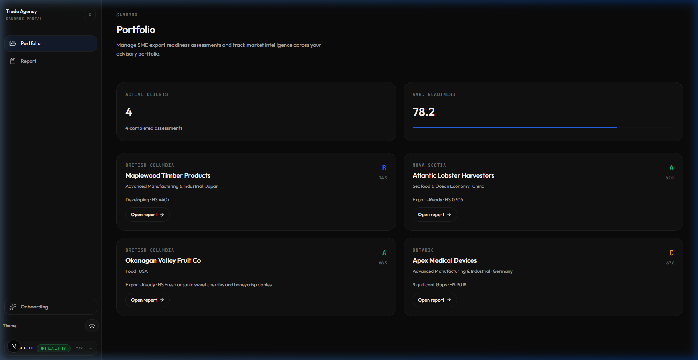

---

### 2.2 Readiness Score Gauge

**Business Problem:** Advisors need an immediate, at-a-glance indicator of an SME's overall export readiness. A single number or letter grade isn't enough — the visual encoding must convey severity.

**What it does:**

- Animated SVG circular gauge with the readiness score (0–100) and letter grade (A–F)
- Color-coded ring: green for A, blue for B, amber for C, red for D/F
- Count-up animation on mount for the numeric score
- Grade label below (e.g., "Developing", "Export-Ready", "Significant Gaps")

**Technical Details:**

- Component: `ScoreGauge.tsx` — pure SVG with `motion.circle` for animated `strokeDashoffset`
- Custom hook: `useCountUp()` for animated decimal counter
- Constants: `SIZE=168`, `STROKE=10`, calculated `CIRCUMFERENCE` for arc math
- Transition: Uses `snappy` animation preset (critically-damped spring)

### 2.3 Sanctions & Compliance Screen

**Business Problem:** Before proceeding with any export engagement, advisors must verify the SME isn't on any sanctions or restricted entity lists. Failing to screen could result in severe legal penalties.

**What it does:**

- Text input pre-filled with the SME's name, with search button
- Normalizes the query (uppercase, trimmed) for consistent matching
- Calls `/api/sandbox/screen` to check against SEMA / Consolidated Screening List
- Shows "Clear" badge (green shield) or "Match Found" alert (red triangle) with matched entries
- Displays data origin (live/cache/mock-fallback) for audit trail

**Technical Details:**

- Component: `SanctionsScreen.tsx`
- Backend: `lib/sanctions-checker.ts` — `normalizeQuery()` for consistent name matching
- API: `/api/sandbox/screen` checks against structured sanctions data
- Animation: `motion.button` with `whileTap` scale and `motion.div` for result reveal

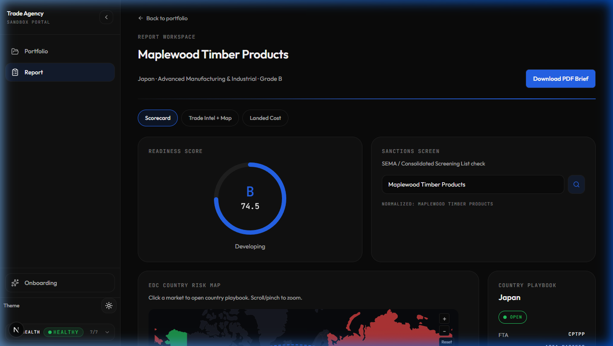

---

### 2.4 EDC Country Risk Map & Country Playbook

**Business Problem:** Export risk isn't just about the product — it's about the destination. Advisors need to visualize which markets are open, restricted, or blocked according to Export Development Canada's risk classifications, and quickly access market intelligence for any country.

**What it does:**

- **Risk Map**: Interactive Mercator world map colored by EDC risk tier:
  - 🟢 **Open** — low-risk, full coverage available
  - 🟠 **Watch** — elevated risk, selective coverage
  - 🔴 **Restricted** / **Blocked** — high risk, limited or no EDC coverage
- Animated dashed shipping lane arc from Canada to the selected target country
- Zoom/pan controls (scroll + buttons), reset functionality
- **Country Playbook** side panel: When a country is clicked, shows:
  - FTA status (e.g., CPTPP for Japan), region, default tariff rate
  - Freight cost per FEU in CAD, import volume, YoY change
  - Sanctions clearance status, FTA notes

**Technical Details:**

- Map: `@visx/geo` Mercator projection + `@visx/zoom` for pan/zoom
- Topology: `world-atlas@2` (110m resolution) loaded from CDN, parsed with `topojson-client`
- Risk data: `lib/country-risk-data.ts` — 28 EDC-tracked markets with ISO3 codes and numeric IDs
- Fallback: `buildMinimalWorld()` generates simple polygons if CDN fetch fails
- Shipping lane: SVG quadratic Bézier curve (`Q` path command) between Canada centroid and target country centroid
- Playbook: `CountryPlaybook.tsx` + `lib/mock-fallback-data.ts` for market profiles

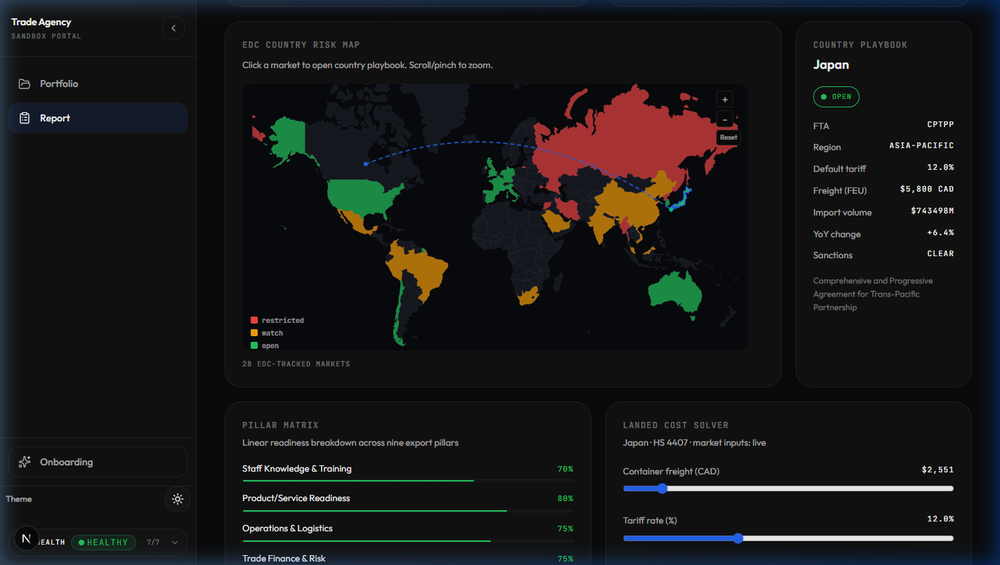

---

### 2.5 Pillars Matrix

**Business Problem:** A single aggregate readiness score hides the nuance. Advisors need to see exactly which of the nine export readiness pillars are strong vs weak to guide their advisory recommendations.

**What it does:**

- Displays nine export pillars as horizontal animated bar charts:
  1. Staff Knowledge & Training
  2. Product/Service Readiness
  3. Operations & Logistics
  4. Trade Finance & Risk
  5. Legal & Regulatory
  6. Strategy & Market Selection
  7. Cultural Readiness
  8. Digital & E-Commerce
  9. Program & Funding
- Color-coded by score: ≥70% green, ≥50% blue, ≥25% amber, <25% red
- Animated bar width with `motion.div` spring transition

**Technical Details:**

- Component: `PillarsMatrix.tsx`
- Data: `Record<PillarKey, number>` from the assessment record
- Labels: `PILLAR_LABELS` from `lib/scoring-engine.ts`
- Layout: CSS flex column with progress bars using `progress-track` / `progress-fill` classes

### 2.6 Critical Gap Analyzer

**Business Problem:** Advisors need to quickly identify which pillars fall below the readiness threshold (default 50%) so they can prioritize remediation efforts.

**What it does:**

- Filters pillars below the configurable threshold (default 50%)
- Lists them sorted by score (lowest first) with red percentage badges
- If no gaps exist, shows a green "No critical gaps" message

**Technical Details:**

- Component: `CriticalGapAnalyzer.tsx`
- Props: `pillarScores` + optional `threshold` (default 50)
- Staggered entrance animation with 40ms delay per gap item

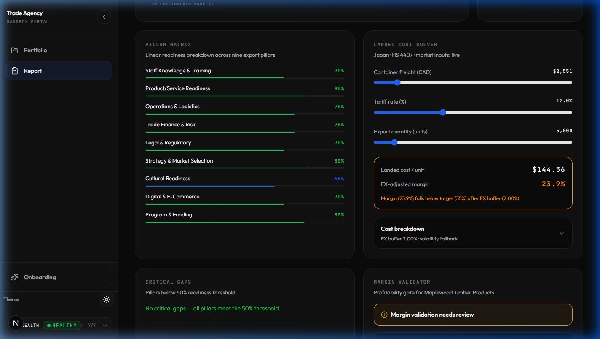

---

### 2.7 Landed Cost Solver

**Business Problem:** Understanding whether an export deal is profitable requires calculating the total "landed cost" — production + freight + tariffs + insurance + brokerage + FX buffer. Advisors need an interactive tool to model different scenarios.

**What it does:**

- Three interactive sliders for real-time scenario modeling:
  - **Container freight (CAD)**: $1,500 – $12,000 range
  - **Tariff rate (%)**: 0% – 35% range
  - **Export quantity (units)**: 500 – 50,000 range
- Results panel showing:
  - **Landed cost per unit** (e.g., $144.56)
  - **FX-adjusted margin** (e.g., 23.9%) with color-coded border (green = pass, amber = near, red = insolvent)
  - Warning text when margin falls below target
- Expandable cost breakdown disclosure panel:
  - Unit freight, tariff per unit, broker fee, insurance, actual margin, target margin

**Technical Details:**

- Component: `LandedCostSolver.tsx`
- Calculator: `lib/landed-cost-calculator.ts` — `calculateLandedCost()` with FX volatility buffer
- Market inputs: Fetches live data from three APIs in parallel:
  - `/api/sandbox/freight` — container freight rates by origin/destination
  - `/api/sandbox/tariffs` — HS code tariff lookup by country
  - `/api/sandbox/rates` — FX volatility (30d/90d) for currency hedging
- Fallback: `lib/mock-fallback-data.ts` — `getCountryFallback()` for structured fallback when APIs fail
- FX Buffer: Uses 30-day or 90-day volatility to compute a currency risk buffer
- Data origin indicator: Shows `live`, `mock-fallback`, or `structured-fallback`
- UI: `SliderField` sub-component for range inputs, `FolderDisclosure` for expandable breakdown

---

### 2.8 Margin Validator

**Business Problem:** Even if the landed cost is calculated, advisors need a pass/fail gate to confirm the deal is profitable. Three key checks must all pass for an export deal to be viable.

**What it does:**

- Three validation checks, each with pass ✅ / fail ⚠️ indicator:
  1. **Unit price covers landed cost** — headroom per unit
  2. **Meets target profit margin** — target vs FX-adjusted margin comparison
  3. **FX volatility buffer applied** — confirms buffer percentage from 30d/90d volatility
- Summary badge: "Margin validation passed" (green) or "Margin validation needs review" (amber)

**Technical Details:**

- Component: `MarginValidator.tsx`
- Reuses: `calculateLandedCost()` from `lib/landed-cost-calculator.ts`
- Props: Accepts optional pre-computed `LandedCostResult` to avoid duplicate calculation
- Icons: `CheckCircle2` and `AlertCircle` from `lucide-react`

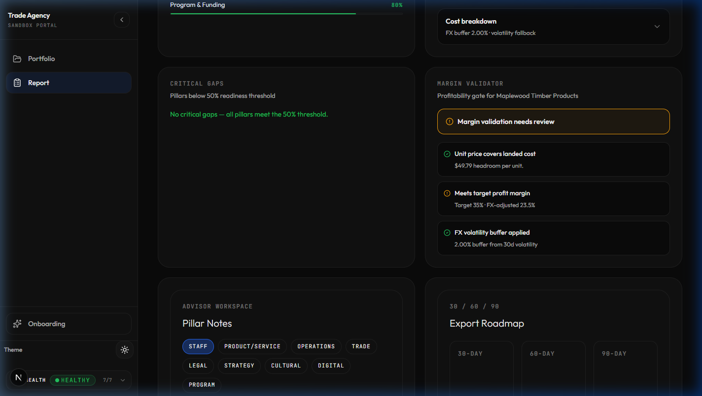

---

### 2.9 Advisor Notes Panel

**Business Problem:** Advisors accumulate knowledge about each SME over time — notes per pillar, observations, recommendations. This needs to be persisted, organized by pillar, and auto-saved to avoid data loss.

**What it does:**

- Nine pillar tabs (Staff, Product/Service, Operations, Trade, Legal, Strategy, Cultural, Digital, Program)
- Textarea for free-form notes per pillar
- **Auto-save**: Notes are debounced (700ms delay) and persisted via `PUT /api/advisor-notes`
- Timestamp display: "Saved 01:41:58 · Assessment ASM-0000"

**Technical Details:**

- Component: `AdvisorNotesPanel.tsx`
- State: `Record<string, string>` map of pillar → content
- Auto-save: `useEffect` with `window.setTimeout` debounce (700ms)
- API: `GET /api/advisor-notes?assessmentId=...` (load), `PUT /api/advisor-notes` (persist)
- UX: `motion.button` with `whileTap` for pillar tab interactions

### 2.10 Roadmap Timeline (30/60/90)

**Business Problem:** Export readiness isn't instant — it requires a phased action plan. Advisors need to organize remediation tasks into 30-day, 60-day, and 90-day buckets, and reorder priorities via drag-and-drop.

**What it does:**

- Three-column Kanban-style board: 30-day, 60-day, 90-day buckets
- Drag-and-drop cards between columns and within columns
- Each card shows a remediation task
- Reordering is persisted via `PATCH /api/roadmap`

**Technical Details:**

- Component: `RoadmapTimeline.tsx`
- Drag-and-drop: `@dnd-kit/core` + `@dnd-kit/sortable` with `PointerSensor` (6px activation constraint)
- Sub-component: `SortableCard` using `useSortable` hook with CSS transform
- `DragOverlay`: Premium styled overlay card during drag
- Persistence: `arrayMove()` for reordering, then `Promise.all()` batch PATCH to `/api/roadmap`
- Layout: CSS Grid `gridTemplateColumns: repeat(3, minmax(0, 1fr))`

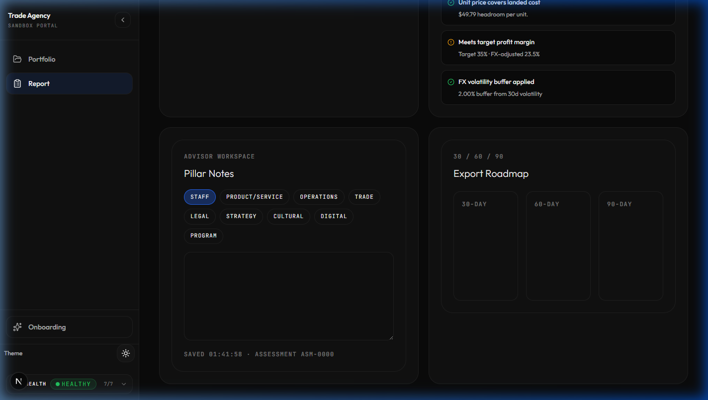

---

### 2.11 Trade Intelligence Dashboard

**Business Problem:** Advisors need UN Comtrade-level trade data to understand market dynamics — import volumes, growth trends, competitive landscape, and seasonality — without leaving the portal.

**What it does:**

- **Hero metric**: Total Import Volume with YoY change indicator (▲/▼ with percentage)
- **5-Year Import Trend**: Line chart showing import value trajectory (2015–2024)
- **Bilateral Market Competitors**: Table of top 10 countries exporting the same HS code to the target market, with:
  - Rank, country name, export value (USD), market share percentage + bar visualization
- **Import Seasonality**: Bar chart showing monthly volume index
- Data source badge: `cache`, `live`, or `unknown`

**Technical Details:**

- Component: `TradeIntelDashboard.tsx`
- Charts: `recharts` v3 — `LineChart`, `BarChart`, `ResponsiveContainer`, `Tooltip`
- Data: Three parallel API calls to `/api/sandbox/comtrade`:
  - `type=summary` — aggregate volume and YoY
  - `type=partners` — bilateral partner ranking
  - `type=trend` — multi-year time series
- Cache layer: `lib/comtrade-cache.ts` for reducing API calls
- Formatting: `formatCurrency()` for millions, `formatCompact()` for billions

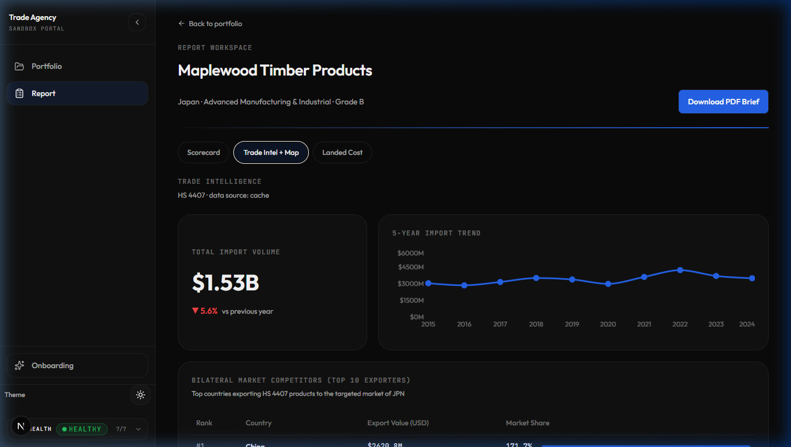

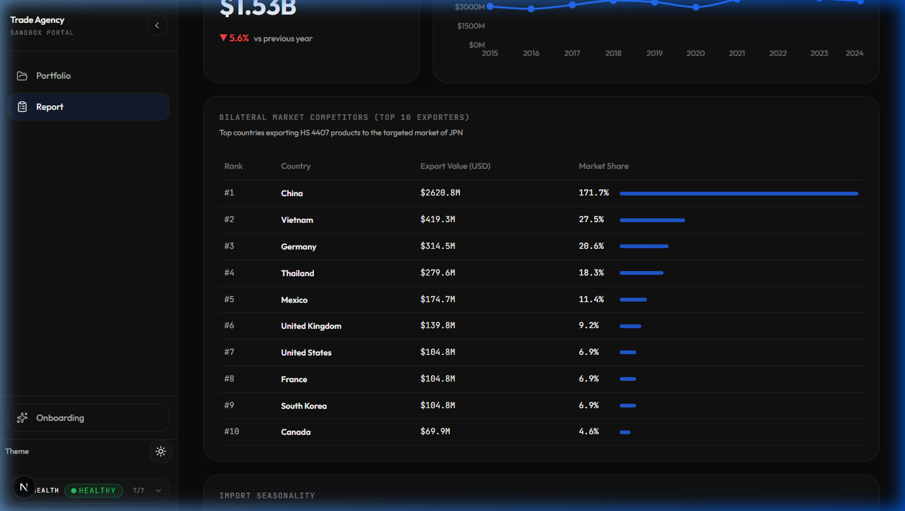

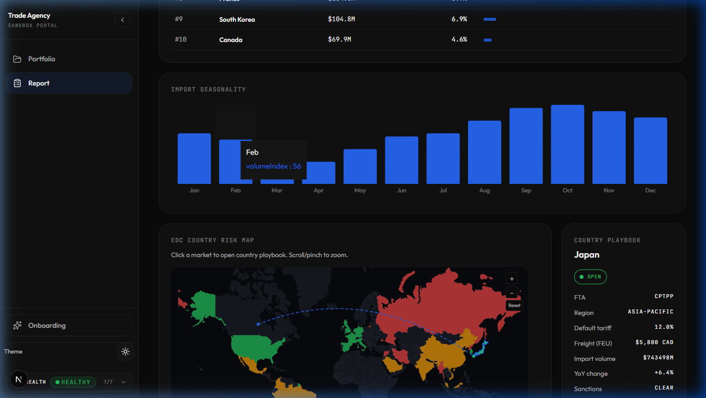

---

### 2.12 PDF Brief Generator

**Business Problem:** Advisors need to produce professional PDF reports for their SME clients or for internal review. The report should be downloadable with a single click.

**What it does:**

- "Download PDF Brief" button in the report workspace header
- Loading state: "Generating PDF…" with disabled button
- Downloads as `export-readiness-<assessmentId>.pdf`
- Error handling with inline error message display

**Technical Details:**

- Component: `PdfBriefGenerator.tsx`
- Backend: `POST /api/report/pdf` with `puppeteer` v25 for server-side PDF rendering
- Flow: POST → receive blob → `URL.createObjectURL()` → programmatic anchor click → cleanup
- Error: Parses JSON error body for user-friendly messages

---

### 2.13 Landed Cost Tab (Dedicated View)

**Business Problem:** Some advisory sessions focus entirely on cost modeling. The dedicated Landed Cost tab provides expanded layouts for the solver and margin validator, alongside the full readiness scorecard.

**What it does:**

- Larger Landed Cost Solver (8-column span) paired with Margin Validator (4-column span)
- Full Readiness Scorecard below (Score Gauge + Pillars Matrix + Critical Gaps + AI Advisory Summary)

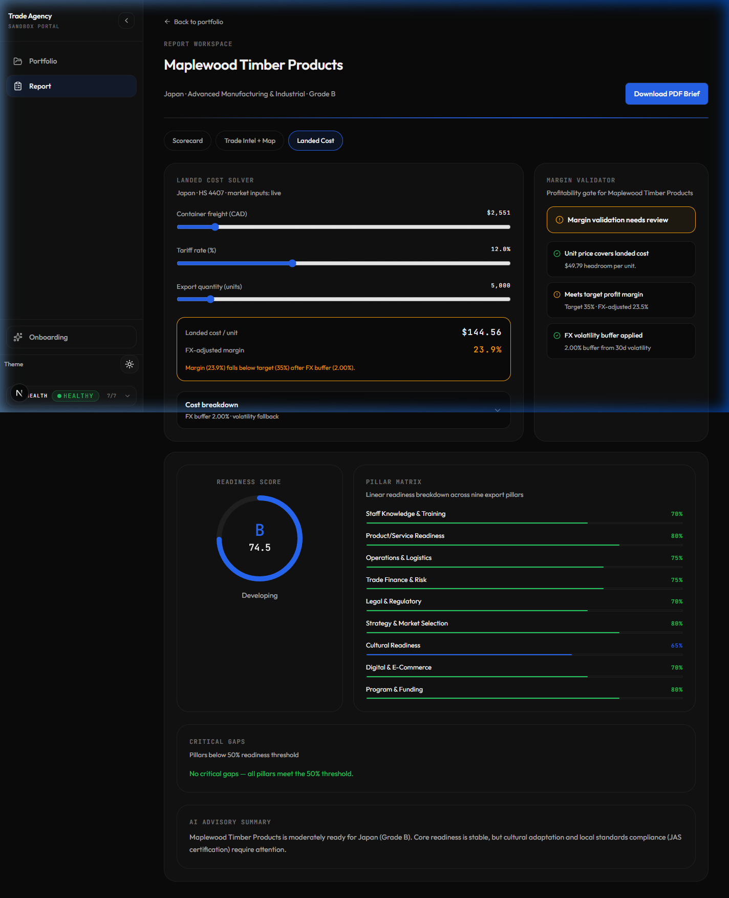

---

## 3. Tech Stack Summary

### Frontend

| Layer      | Technology                            | Version                |
| ---------- | ------------------------------------- | ---------------------- |
| Framework  | Next.js (App Router)                  | 15.5.20                |
| Runtime    | React                                 | 19.1.0                 |
| Language   | TypeScript                            | 5.x                    |
| Bundler    | Turbopack                             | (built-in)             |
| Styling    | Tailwind CSS + custom CSS variables   | 3.4.17                 |
| Typography | Outfit (sans) + JetBrains Mono (mono) | Google Fonts           |
| Theme      | Dark-first with light mode toggle     | `data-theme` attribute |
| Icons      | Lucide React                          | 1.24.0                 |

### Visualization & Interaction Libraries

| Purpose     | Library                                                | Usage                                                       |
| ----------- | ------------------------------------------------------ | ----------------------------------------------------------- |
| Charts      | `recharts` v3.9.2                                      | Line charts (5yr trend), Bar charts (seasonality), tooltips |
| Geo Map     | `@visx/geo` v4                                         | Mercator world projection for EDC risk map                  |
| Map Zoom    | `@visx/zoom` v4                                        | Pan/zoom/reset on the country risk map                      |
| Topology    | `topojson-client` v3                                   | Parsing world-atlas TopoJSON → GeoJSON features             |
| Animation   | `motion` (Framer Motion) v12.42.2                      | Spring transitions, staggered entrances, layout animations  |
| Drag & Drop | `@dnd-kit/core` v6 + `@dnd-kit/sortable` v10           | Roadmap timeline kanban board                               |
| CSS Utils   | `clsx` + `tailwind-merge` + `class-variance-authority` | Conditional class merging                                   |

### Backend / Data Layer

| Layer         | Technology                                             | Purpose                                                      |
| ------------- | ------------------------------------------------------ | ------------------------------------------------------------ |
| Database      | Supabase (`@supabase/supabase-js` v2, `@supabase/ssr`) | Primary data store for SMEs, assessments, notes              |
| Fallback DB   | `lib/csv-db.ts` + `lib/in-memory-store.ts`             | CSV-backed and in-memory stores when Supabase is unavailable |
| AI            | `@google/generative-ai` v0.24.1 (Gemini)               | AI advisory summaries in assessment reports                  |
| PDF Gen       | `puppeteer` v25                                        | Server-side headless Chrome PDF rendering                    |
| Validation    | `zod` v4                                               | Schema validation for API payloads                           |
| Date Handling | `date-fns` v4                                          | Date formatting and manipulation                             |

### External Data Sources

| Source          | Endpoint                            | Data                                                        |
| --------------- | ----------------------------------- | ----------------------------------------------------------- |
| UN Comtrade     | `/api/sandbox/comtrade`             | Import volumes, bilateral trade partners, multi-year trends |
| Tariff Database | `/api/sandbox/tariffs`              | HS code tariff rates by country                             |
| Freight Rates   | `/api/sandbox/freight`              | Container shipping rates by route                           |
| FX Rates        | `/api/sandbox/rates`                | Exchange rates + 30d/90d volatility                         |
| Sanctions List  | `/api/sandbox/screen`               | SEMA / Consolidated Screening List entity check             |
| EDC Risk Tiers  | Local data (`country-risk-data.ts`) | 28 country risk classifications                             |

### Infrastructure

| Concern           | Implementation                                                |
| ----------------- | ------------------------------------------------------------- |
| Health Monitoring | `/api/health` — checks 7 subsystems, exposed in sidebar badge |
| Authentication    | `lib/auth.ts` + Supabase Auth middleware                      |
| Environment       | `.env.local` with `lib/env.ts` validation                     |
| Testing           | Vitest + Testing Library + MSW + Playwright                   |
| CI                | GitHub Actions (`.github/`)                                   |
| Container         | Dockerfile for production deployment                          |

---

## 4. Page Flow Summary

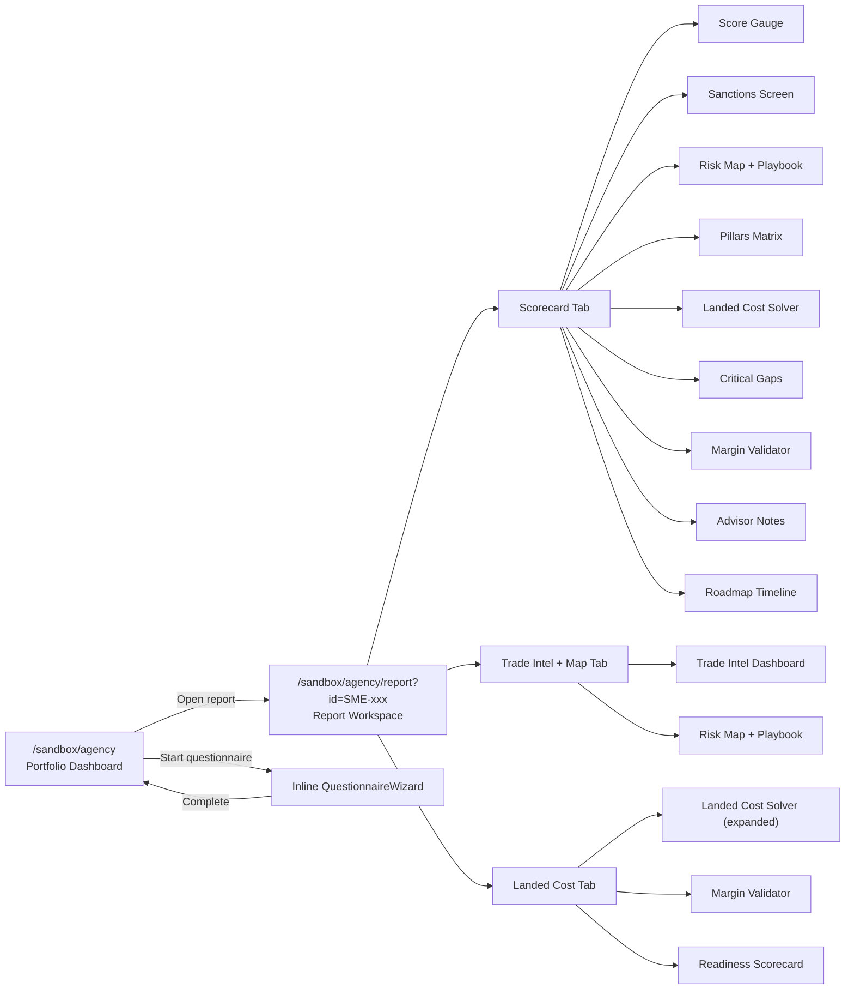

---
